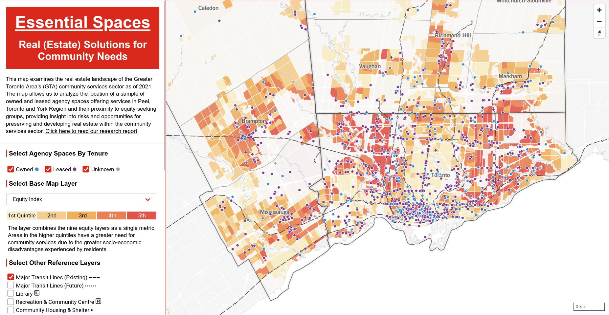

This repo contains the code and data to build https://schoolofcities.github.io/essential-spaces/map

[Read our report](https://www.unitedwaygt.org/wp-content/uploads/2024/10/Essential-Spaces-Full-Report-compressed.pdf) for details about the data, methods, and research that this map supported

Spatial data download links:
- [Agency spaces](/src/routes/map/assets/SPRE_2021_wgs84.geo.json) (note that this data are a sample and not 100% representative of all locations in the region)
- [Demographic and socio-economic data](/src/routes/map/assets/ct-data-all.geo.json) (at Census Tract geography)
- [Libraries](/src/routes/map/assets/library.geo.json)
- [Recreation centres](/src/routes/map/assets/rec.geo.json)
- [Major Transit Lines (Existing)](/src/routes/map/assets/transitLines-toronto.geo.json)
- [Major Transit Stops (Existing)](/src/routes/map/assets/transitStops-toronto.geo.json)
- [Major Transit Lines (Future)](/src/routes/map/assets/transitLines-toronto-future.geo.json)
- [Major Transit Stops (Future)](/src/routes/map/assets/transitStops-toronto-future.geo.json)
- [Upper Tier Municipal Boundaries](/src/routes/map/assets/admin-upper-tier.geo.json)
- [Lower Tier Municipal Boundaries](/src/routes/map/assets/admin-lower-tier.geo.json)
- All other reference data (e.g. streets, water, etc.) are from [OpenStreetMap](https://www.openstreetmap.org/): 